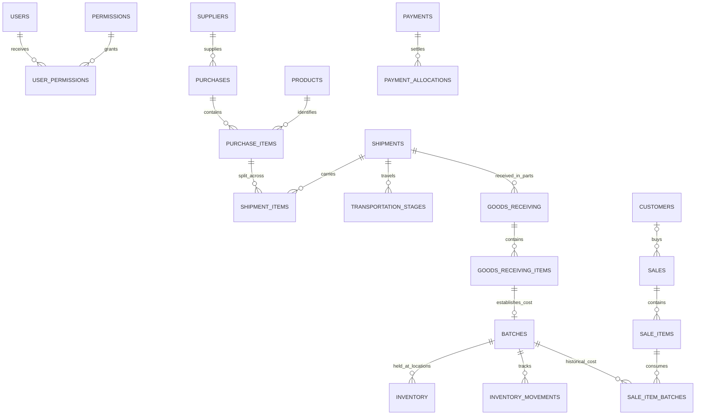

# Phase 2 — PostgreSQL database design

The complete system specification remains the business source of truth. The user's Phase 2 request explicitly authorizes the database design across modules; it does not authorize building all of their APIs or screens. This schema establishes those relationships so later modules can still be developed as vertical slices.

## Schema map

All business objects are in `app`; migration metadata is in `public.schema_migrations`.

| Area | Tables / views |
|---|---|
| Identity and access | `roles`, `users`, `permissions`, `user_permissions`, `user_sessions` |
| Catalog and parties | `categories`, `brands`, `units`, `products`, `product_units`, `product_suppliers`, `suppliers`, `customers`, `warehouses` |
| Currency | `currencies`, `exchange_rates` |
| Procurement | `purchases`, `purchase_items`, `shipments`, `shipment_items`, `transportation_stages`, `shipment_expenses` |
| Receiving and costing | `goods_receiving`, `goods_receiving_items`, `batches` |
| Stock | `inventory`, `inventory_movements`, `stock_adjustments`, `stock_adjustment_items`, `stock_transfers`, `stock_transfer_items`, `stock_takes`, `stock_take_items`, `damaged_products`, `missing_products` |
| Sales and returns | `sales`, `sale_items`, `sale_item_batches`, `sales_returns`, `sales_return_items`, `purchase_returns`, `purchase_return_items` |
| Finance | `payments`, `payment_allocations`, `expense_categories`, `expenses` |
| Control | `approvals`, `audit_logs`, `attachments`, `attachment_links` |
| Derived views | `purchase_totals`, `sale_totals`, `customer_debts`, `supplier_payables` |

Customer debts and supplier payables are **views**, not separately editable balances. This avoids a second total that can drift from invoices, returns, and settlement history. Negative outstanding amounts represent credits, not a negative charge. Overdue status is computed using the database's current date; configure the production database/reporting timezone to Asia/Yangon.

## Data conventions

- UUID primary keys use PostgreSQL's `gen_random_uuid()`; human document numbers have unique constraints. Identity joins, financial document links, and stock provenance use foreign keys, normally restrictive deletion.
- Every table has `created_at TIMESTAMPTZ`. Mutable entities also have `updated_at` maintained by a trigger. Dates without a time (expiry, manufacture, payment due date) use `DATE`. Append-only tables intentionally have no editable `updated_at`.
- Amounts and totals use `NUMERIC(20,4)`; entered unit prices use `NUMERIC(20,6)`; quantities, weights, and packaging conversion snapshots use `NUMERIC(20,6)`; batch unit costs use `NUMERIC(24,8)`; exchange rates use `NUMERIC(24,10)`.
- Monetary totals round explicitly to four decimal places, with PostgreSQL numeric rounding. Display/invoice rounding to currency minor units is a later workflow rule; it must not silently discard stored precision. Values exceeding precision fail. Numeric `NaN` is rejected, and fixed-precision numeric columns reject infinities.
- No `REAL`, `DOUBLE PRECISION`, PostgreSQL `money`, or Go floating-point fields are used for amounts. sqlc generates `pgtype.Numeric`. Future JSON APIs must send exact decimals as strings and use exact decimal/integer arithmetic.
- All conversion rates mean **MMK per one source-currency unit**. MMK transactions require a rate of 1. Historical rate rows are append-only. Transactions store their own rate; selecting a rate ID also requires the quote's currency and value to match.
- Global timestamps are instants. Backend/reporting boundaries must consistently convert business dates to Asia/Yangon.

## Purchasing, receiving, and stock

Packaging is normalized in `product_units`: one product can have bottle, pack, carton, and other selling/purchasing units. Transactions snapshot `units_per_pack` and unit prices, so later catalog changes do not recalculate past invoices. Quantities in shipment, receipt, batch, stock, and batch-consumption rows are **base units**. Each transaction line stores its entry unit as well as its generated base quantity.

A purchase item can be split across shipments. A shipment can contain items from several purchases and suppliers; its suppliers are derived through purchase lines, avoiding a conflicting single supplier field. Transportation has unlimited numbered stages. Stage loading/unloading fees are separate from shipment expenses; the future costing service must prevent entering the same expense twice.

Shipment allocation supports quantity, purchase value, weight, carton quantity, and manual allocation. Each item stores allocated transportation and additional expenses in MMK. Cost-finalization locks those allocations and cost-source rows.

Receipts may be split over time and batches. `received_quantity` includes damaged units; missing and excess quantities are separate generated values. `damaged_quantity <= received_quantity`. Each receipt item can establish one cost batch; split receipt lines for multiple batches. Batch identity is an internal UUID, so supplier batch labels can repeat across deliveries with different historical costs.

A batch stores purchase, transport, and other costs, plus original sellable quantity. Actual unit cost is their sum divided by sellable quantity. If the entire lot is lost/damaged, sellable quantity is zero and unit cost is NULL; record the total cost as a write-off in the receiving/costing workflow. Never divide by zero or silently assign zero unit cost. Finalized batches cannot be edited or deleted.

Inventory is a per-warehouse/per-batch balance. Sellable stock includes reserved stock; available = sellable − reserved. Damaged stock is separate. None may be negative, and reservations cannot exceed sellable stock. Movement rows have signed deltas, an idempotency key, one real source FK, and optional reversal linkage. They are append-only.

A sale item can consume several batches through `sale_item_batches`. This retains actual COGS for FIFO or a later selected costing method. Returns point back to the original sale item and consumed batch. Gross profit uses these historical costs, not current catalog prices. Operating expenses remain separate from landed-cost expenses for net profit reporting.

## Payments, credits, and returns

Payments store original currency amount, settlement exchange rate, direction, payment method, and converted MMK amount. Partial payments are multiple payment allocations; credit is an unpaid balance, not a fictitious cash payment method.

Each allocation references exactly one sale, purchase, return, operating expense, transport stage, or shipment expense. Direction and customer/supplier identity are checked. `applied_original` is in the **target document's currency**; `applied_mmk` is its historical book value. `settlement_mmk` is actual cash settlement value. Their difference supports realized FX gain/loss without rewriting purchase costs. Example: settling 3,000 INR at 30 MMK against a purchase at 25 MMK consumes 90,000 MMK cash and clears 75,000 MMK of book liability.

Posting rejects allocations greater than the payment amount. Unallocated cash can represent a deposit; future customer/supplier balance reports must include it separately from the invoice-level debt views. Returns reduce balances, and actual refunds offset return credits to avoid counting both a refund and an unused credit. Payment reversal records retain the opposite cash movement; the original is marked REVERSED and its allocations cease contributing. Reversal and stock/ledger effects must be performed together in the later transaction service.

Posted documents and their detail rows are immutable except for marking the original document REVERSED. Drafts can be corrected; completed transactions are not deleted. No cascading deletion of financial or inventory history is configured.

## Backend authorization

Only `SUPER_ADMIN` and `STAFF_ADMIN` exist. The role table is seeded with those values and constrained against all others; its rows cannot be edited/deleted. No default login, password, session, or staff grant is seeded.

`user_permissions` grants known permission codes per account. Staff have no permissions by default. Active Super Admins have every registered permission. The catalog separates operational access from sensitive costs, exchange rates, profit reports, refunds, reversal, approval, users, permission management, and audit access.

Go's `authz.Service.Require` authenticates an opaque bearer token by its SHA-256 hash in `user_sessions`, then queries current user status and permissions. Session expiration, revocation, password changes, or account deactivation invalidate access. The backend rejects forged user/role headers. Database errors fail closed. `GET /api/v1/permissions` demonstrates real enforcement of `permissions.manage`; both health endpoints remain public.

Phase 3 now implements session issuance, password hashing, login/logout, and audited permission management; see [authentication](authentication.md). Future business endpoints and sensitive response fields must use the centralized permission system. Production must separate migration-owner credentials from a restricted runtime database role; the local Compose credential remains development-only.

Approvals reference an actual target, required permission, requester, decision, payload hash, and consumption time. These columns do not themselves authorize an action: the service must verify the deciding user's current permission, bind approval to the exact requested values, and consume it once inside the transaction. Audit logs are append-only; entity references are intentionally snapshots (`entity_type`, `entity_id`) rather than a polymorphic fake FK. Attachments use real typed link FKs and store object metadata, not file contents or arbitrary public URLs.

## Enforcement boundary for later vertical slices

This phase enforces types, row constraints, foreign-key identity, numeric validity, uniqueness, payment party/direction/rate checks, historical immutability, and backend request authorization. It **does not implement posting workflows**. Before exposing any business mutation, its slice must test and implement:

- Lock purchase/receipt/batch rows and prevent cumulative over-shipment, double receipt, over-return, or overselling. Validate batch lineage and source location for every movement type, including transfer and reversal.
- Reconcile cost allocations to shipment costs exactly (including rounding residuals), receipt quantities to finalized batches, sale batch allocations to sold quantities, and ledger deltas to stock balances.
- Update inventory balance, movement, invoice, payment, approval consumption, and audit records atomically. The schema does not automatically move stock when a document is inserted.
- Require appropriate status transitions, nonempty posted documents, applicable expiry/below-cost/discount checks, valid approvals, and authorized field-level financial access.
- Validate catalog base-unit conversion, precision/invoice rounding, selected costing method, returns against amounts/quantities originally sold, and the handling of deposits and realized FX in reporting.
- Prevent duplicate expense entry and repeated payment/webhook processing; use unique idempotency keys where appropriate.

These are deliberate service-level transaction responsibilities, not removed business rules. The schema alone must not be described as a completed POS/financial engine.

## Migrations and operations

`database/migrations/000001_*.sql` through `000007_*.sql` are canonical. sqlc reads the same files. `make migrate` locks migration execution, validates prior checksums, and applies all pending files and their metadata in one transaction. If any statement fails, pending DDL and metadata roll back. Repeated execution is a no-op. Applied files must never be changed or removed; add the next numbered file. There is no destructive down/reset operation. Recovery uses a corrective migration or a verified backup restore.

The Phase 1 empty `app` schema upgrades in place. Docker runs the migration service before the API; `make dev` does the same. Foreign keys receive supporting indexes where no existing index covers the leading tuple. Additional indexes support invoice dates, due dates, FIFO batches, expiry, stock history, pending approvals, and audit history. Revisit indexes using real query plans when the relevant APIs exist.

Tests run in randomly named disposable databases and clean them up. The testing credential needs CREATEDB; never point the integration suite at a production server. The schema fixture contains only synthetic data and is never loaded by production migrations.

References: [PostgreSQL constraints](https://www.postgresql.org/docs/17/ddl-constraints.html), [transaction and advisory locks](https://www.postgresql.org/docs/17/explicit-locking.html).
